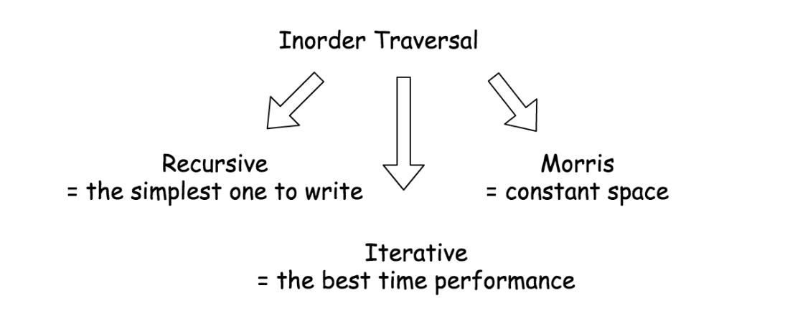

# Tree

短暂的总结一下257 112 113 129 298 11 104 都用了差不多的套路 就是dfs的时候 当左右子树节点为空 做一些操作， 其他时间判断左子树或右子树是否为空 如果不为空就继续遍历 ，值得注意的是如果是数字或者string的话，是不需要pop的，但是需要直接传入下一个helper func 不可以另行赋值，如果是stack需要pop。时间复杂度是n一般 空间最优是logn 最差的是n。注意有的时候分治的解法会更加简单哦

BST的时候讨论inorder更有趣哦，以及bst有个很有趣的图

